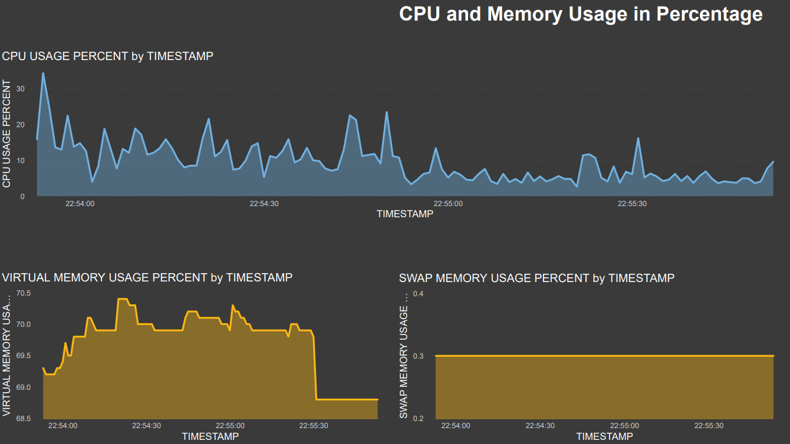
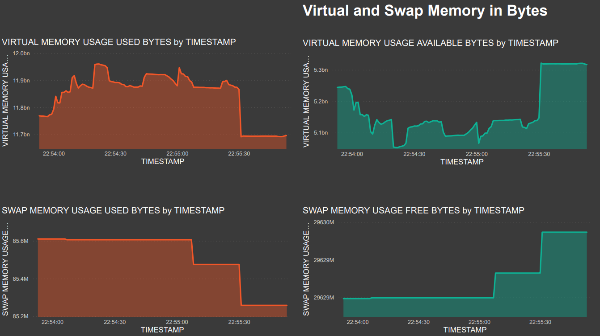
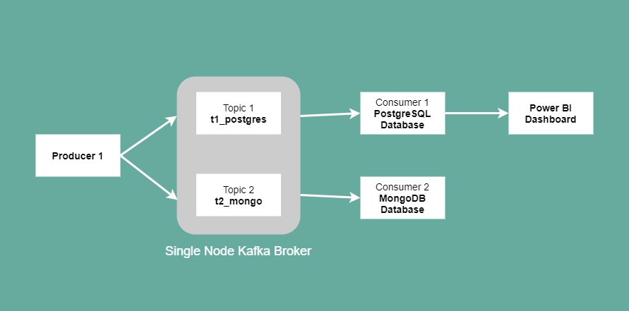

# Real-time CPU Monitoring with Kafka & Power BI

Real-time CPU usage monitoring with **Kafka** streaming and **Power BI** interactive reports

## Description

Built a system to take infrastructure time series properties, such as CPU load as an input. 
Streamed metrics between a Kafka producer and two Kafka consumers (i.e. MongoDB Database and PostgreSQL Database), 
and presented a chart of the CPU load (and similar metrics) using Power BI.

### Prerequisites

* WSL (Windows Subsystem for Linux) version 0.2.1 (for Windows 10 OS users)
* Java JDK version 12.0.2
* Gradle version 6.8.3
* Zookeeper version 3.7.0
* Kafka 2.7.0
* PostgreSQL version 11
* pgAdmin version 4.21
* MongoDB version 4.2
* MongoDB Compass Community version 1.21.2
* Power BI Desktop version 2.91.884.0

### Configure

* Zookeeper system variable path
* Zookeeper `zoo.cfg` file, update `dataDir` path (i.e. directory where snapshot is stored)
* Kafka system variable path
* Kafka `server.properties` file, update `log.dirs` path (i.e. directory where log files are stored)
* Kafka `zookeeper.properties` file, update `dataDir` path (i.e. directory where snapshot is stored)

### Implementation High-Level Architecture

### Instructions

1. Open pgAdmin
    * Navigate to SQL scripts in `<PATH>/real-time-infrastructure-monitoring/src/` folder
    * Run `create_postgres_database.sql` SQL script to create Postgres `infrastructure` database
    * Run `create_postgres_schema.sql` SQL script to create Postgres `cpu_usage` schema
    * Run `create_postgres_table.sql` SQL script to create Postgres `kafka_consumer` table

2. Open new Windows CMD terminal (for Windows 10 OS users) or Bash terminal for non-Windows users
    * Run `zkserver` command
    
3. Open new Ubuntu or Bash terminal
    * Navigate to Kafka installation folder `<PATH>/kafka-2.7.0-src/`
    * Run `bin/kafka-server-start.sh config/server.properties` command
    
4. Open new Ubuntu or Bash terminal
    * Navigate to Kafka Consumer 1 (Postgres) Python script `<PATH>/real-time-infrastructure-monitoring/src/kafka_consumer_postgres.py`
    * Run `python <PATH>/real-time-infrastructure-monitoring/src/kafka_consumer_postgres.py` python script
    
5. Open new Ubuntu or Bash terminal
    * Navigate to Kafka Consumer 2 (Mongo) Python script `<PATH>/real-time-infrastructure-monitoring/src/kafka_consumer_mongo.py`
    * Run `python <PATH>/real-time-infrastructure-monitoring/src/kafka_consumer_mongo.py` python script

6. Open new Ubuntu or Bash terminal
    * Navigate to Kafka Producer Python script `<PATH>/real-time-infrastructure-monitoring/src/kafka_producer.py`
    * Run `python <PATH>/real-time-infrastructure-monitoring/src/kafka_producer.py` python script
    
7. Open Power BI Desktop
    * Navigate to `<PATH>/real-time-infrastructure-monitoring/reports/` folder
    * Open `Infrastructure Monitoring.pbix` file
    * Connect Power BI to Postgres database. E.g. `server:localhost; database:infrastructure; schema:cpu_usage; table:kafka_consumer`
    * Build or edit report fields and visualisations if required
    * On `Home` tab, click `Refresh` button to load latest CPU usage metrics from PostgreSQL Database

### Metrics Monitored

* CPU Usage Percent
* Virtual Memory Usage Percent
* Virtual Memory Usage Available Bytes
* Virtual Memory Usage Used Bytes
* Swap Memory Usage Percent
* Swap Memory Usage Free Bytes
* Swap Memory Usage Used Bytes
* Modified Timestamp
* Computer User

